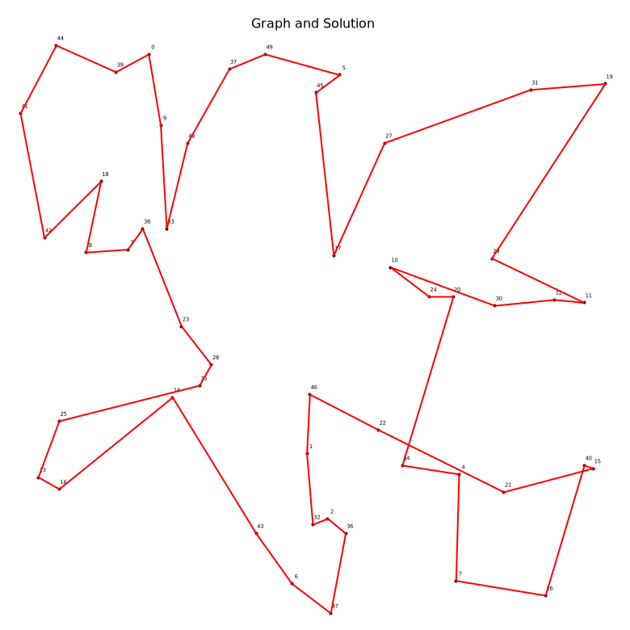
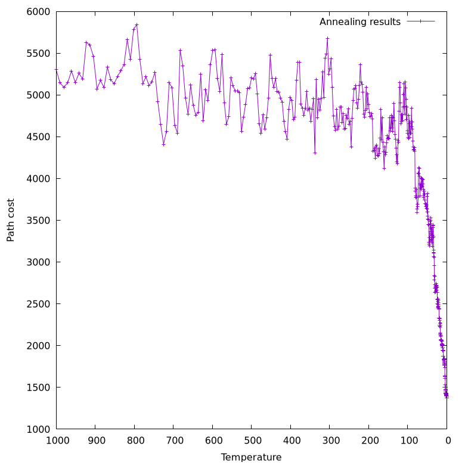
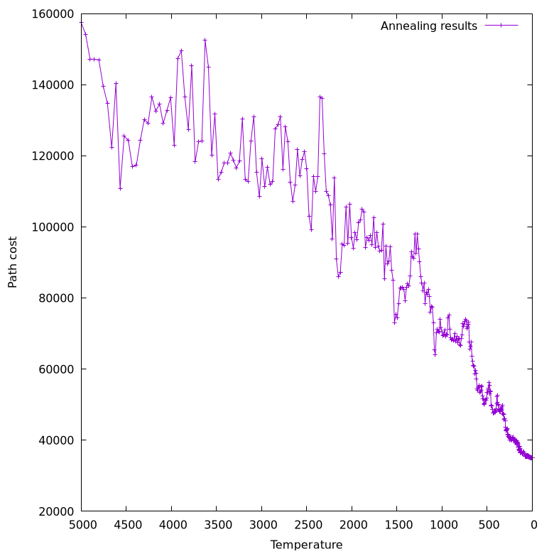
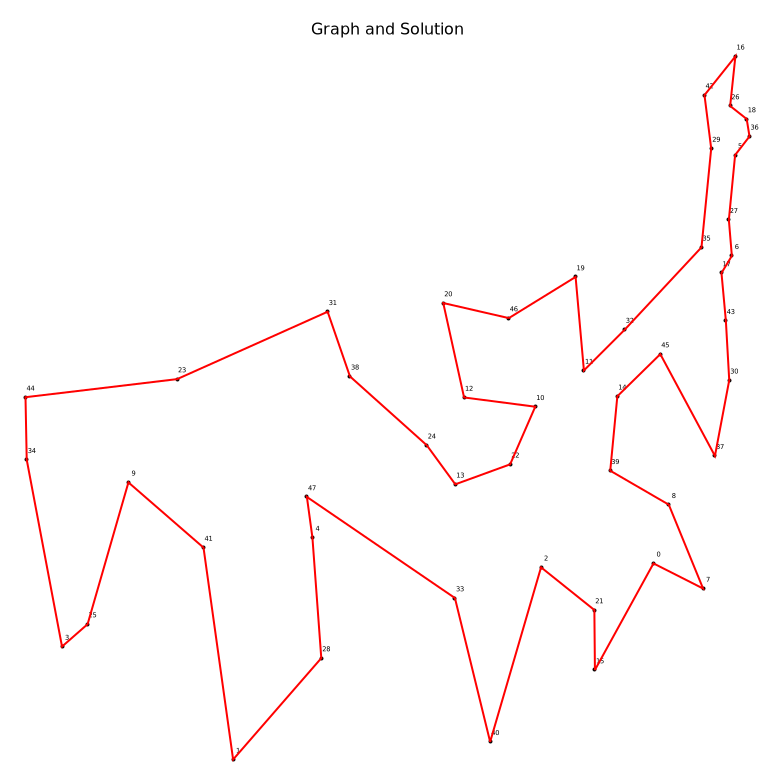

# Description
This program solves the travelling salesman problem using simulated annealing approach. The target graph is a collection of points in 2D space (i.e. x and y coordinate pairs). Simulated annealing does not find the best path, rather it finds the path that is locally optimal (if you are lucky, then globally optimal) path. The search can be tweaked using a set of parameters such as temperature or m-parameter. 

## How to use it?
Make sure you read the `--help` page. Below, I present several examples of usage.

### Basic (randomly generated dataset)
```bash
tasp --output="basic_solve_vis.png" -Asolve_vis
```
This command uses the default parameters (see the help page):
- Temperature: 1000
- Desired temperature: 0.4
- RNG seed: 69
- Vertex count: 50
- Coordinate range: -100..100
- M-parameter: 10
to generate a random graph, and solves it. The command produces an image (basic_solve_vis.png) with the found path visualized. If we also want to plot the steps the simulated annealing performed to find the path, execute:
```bash
tasp -Aplot
```





### ATT48 Dataset
In this example, the graph is input from the standard input where each vertex is a city from the real-world ATT48 dataset [2]. The minimal distance of the path that visits every city once is 33523. To test the program, I use the following command:
```bash
tasp --output="att48.png" --temp=5000 -m40 -Mstd -Aplot < att48.txt
```
Where att48.txt can be found in `tsp/data` in this repository. Please, see the plot below. To get the actual found path-distance, I run:
```bash
tasp --temp=5000 -m40 -Mstd -Asolve < att48.txt
```
to get `34977.593750` which is very close to the global minimum `33523`. To visualize the found path, I run:
```bash
tasp --output="att48_path.png" --temp=5000 -m40 -Mstd -Apath_vis < att48.txt
```





# Installation and building
The program is tested only on Linux (Debian Trixie). Probably, I will make sure it works on Windows and MacOS as well. It is not on my TODO though.

## Prerequisites
Before building and/or installing, make sure you have the following packages
installed:
- GNU Plot
- GNU Make
- gcc
- git
- ccache

On Debian run:
```bash
sudo apt-get install git make gnuplot build-essential ccache
```

# How to build/install
To build, perform the following commands:
```bash
git clone https://github.com/horki-at/tasp 
cd tasp/
make release
```
The executable file will be named `tasp` and located in tasp/ repository.

To install, perform the following commands:
```bash
git clone https://github.com/horki-at/tasp
cd tasp/
make install
```
To install system-wide, use `sudo make install`. Now, you should be able to
use `tasp` in your terminal ([it doesn't work?](#FAQ)).

# FAQ

1) After installing the script, tasp cannot be found. What should I do?
> Make sure the installation path is in your PATH environmental variable:
> - After running `make install`, it will display the installation path.
> - Copy this installion path.
> - Open the shell rc file (e.g. .bashrc) in your editor of choice.
> - Append this line: `PATH := "<copied-installation-path>:$PATH"`.
> - Then, run `source .bashrc` or restart the terminal emulator.
> - `tasp` should be available now.

2) Why I made this project?
> [ICS](https://ocasys.rug.nl/current/catalog/course/WBCS005-05#WBCS005-05.2025-2026.1) required me to make it.

3) What I would do better in the project if I started from scratch?
> 1) Start sooner.
> 2) Implement more TSP-solving algorithms to compare the results. (see [TODO](#todo))
> 3) Use parallel computing. (see [TODO](#todo))
> 4) Add GUI. (see [TODO](#todo))
> 5) Use C++ (though I must have used C for the course).

# References
- [1. Wikipedia: Simulated Annealing](https://en.wikipedia.org/wiki/Simulated_annealing)
- [2. Dataset ATT48](https://people.sc.fsu.edu/~jburkardt/datasets/tsp/tsp.html)

# Known bugs and bad designs
- [ ] Makefile does not track dependencies well => overuse of `make clean`
- [ ] Some parts of the code can benefit from more functions

# Todo
- [x] graph creation
- [x] path creation and manipulation
- [x] implement simulated annealing
- [x] gnuplot
- [x] argument parsing
- [x] fix Makefile precompile headers
- [x] implement actions
  - [x] plot
  - [x] solve
  - [x] path
  - [x] path_vis
  - [x] graph
  - [x] graph_vis
  - [x] graph_vis_nol
  - [x] distances
- [x] output files option
- [x] install script or make rule, + cleaner github repo
- [ ] write the report, mention
  - [ ] an example
  - [ ] this github page
  - [ ] proof why simulated annealing works
  - [ ] the performance of simulated annealing
- [ ] accept other kinds of graphs.
- [ ] implement multiple actions at once.
- [ ] implement the configuration file
- [ ] implement several datasets to test the program on
- [ ] implement more algorithms to solve TSP and compare the results
- [ ] implement parallelism